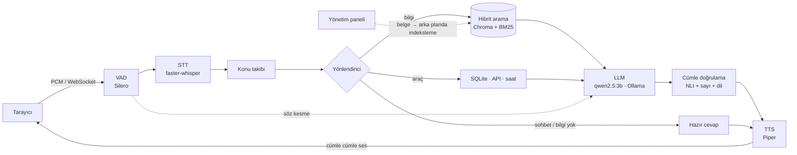

# AkınVoice

AKINROBOTICS robotları, AKINSOFT yazılımları ve iki şirket hakkındaki soruları Türkçe ve İngilizce, **sesli** ve kaynağa dayalı cevaplayan asistan. Bütün bileşenler açık kaynaklıdır ve yerelde çalışır.

▶ **Demo videosu:** [AkınVoice_Demo.mp4 (Google Drive)](https://drive.google.com/file/d/1lE0KrPXu7F9c_RGolkagUBbUNQS82J3N/view?usp=sharing)

## Kurulum ve çalıştırma

```bash
docker compose up
```

**http://localhost:8000** → **Başlat** → mikrofona izin verin ve konuşun. Yönetim paneli: `ADMIN_TOKEN=<anahtar> docker compose up` → `/admin`.

NVIDIA GPU gerekir (Windows'ta Docker Desktop + WSL2 ile hazır gelir). **GPU yoksa** aynı imaj CPU'da çalışır (daha yavaş):

```bash
docker compose -f docker-compose.cpu.yml up
```

İlk çalıştırmada hazır AkınVoice imajı (`ghcr.io/icloolg/akinvoice`, ~4,3 GB, bütün modeller içinde), Ollama imajı (~3,8 GB) ve LLM (~2 GB) iner; sonraki açılışlar çevrimdışıdır. İmajı kaynaktan derlemek için `--build` ekleyin. **Bilgisayarda Ollama zaten kuruluysa** Ollama imajı ve model indirmesi atlanır:

```powershell
$env:OLLAMA_BASE_URL="http://host.docker.internal:11434"; docker compose up --no-deps agent
```

Docker'sız (Python 3.12 + [Ollama](https://ollama.com)):

```bash
pip install -r requirements.txt               # GPU varsa ayrıca: -r requirements-gpu.txt
ollama pull qwen2.5:3b
python -m scripts.download_models --all
python -m scripts.ingest
uvicorn app.main:app --port 8000
```

## Mimari



İki konteyner: AkınVoice sunucusu (FastAPI; STT, arama, doğrulama, TTS) ve LLM için Ollama. **Kaskad mimari (STT → LLM → TTS)** her aşamayı denetlenebilir ve değiştirilebilir kılar; gecikmesi akışla azaltılır: LLM yazarken tamamlanan her cümle doğrulanıp hemen seslendirilir. Bileşenler ortak arayüzleri uygular ve `config.yaml`'dan kurulur; yeni model veya araç bir sınıf + bir kayıt satırıdır.

| Bileşen | Seçim | Gerekçe |
|---|---|---|
| STT | faster-whisper `small`, GPU int8 | Dili aynı geçişte algılar; CPU'da 3,9 sn, GPU int8'de 0,9 sn. |
| Embedding | `multilingual-e5-small` | Tek modelle TR/EN; yönlendirmede de kullanılır. |
| Arama | Embedding + BM25 (RRF), bölüm bazlı parçalar | Ürün adı ve sayıları embedding tek başına kaçırabiliyor. |
| LLM | `qwen2.5:3b` (Ollama) | 4 GB VRAM'e Whisper ile birlikte sığan, Türkçesi yeterli en büyük model. |
| Doğrulama | mDeBERTa NLI (ONNX) | Her cümle seslendirilmeden kaynağa karşı kontrol edilir; desteklenmeyen cümle söylenmez. |
| TTS | Piper (CPU) | RTF ~0,06–0,10; GPU'yu LLM ve STT'ye bırakır. |
| Araçlar | Anlamsal yönlendirme, sabit SQL | Function-calling 3B modelde güvenilmez ve +1–2 sn; text-to-SQL yerine beyaz liste. |
| Takip soruları | Konu takibi (bilinen adlar) | "Kaç saat çalışır?" son konuşulan adla aranır: ~0 ms; LLM ile soru yeniden yazma +1–2 sn. |

Halüsinasyona karşı: eşik altında LLM çağrılmaz, prompt yalnızca bağlama izin verir, her cümle ve içindeki sayılar kaynakta doğrulanır (uydurma bir ek varsa yalnızca desteklenen baş kısmı söylenir), Latin dışı yazıdaki cümle hiç seslendirilmez, hesaplar SQL'de yapılır. Ayrıntılar: [`docs/TASARIM.md`](docs/TASARIM.md) · ölçüm günlüğü: [`NOTLAR.md`](NOTLAR.md).

## Ölçüm sonuçları

**Donanım:** Windows 11 dizüstü · Intel i7-10750H · 16 GB RAM · NVIDIA GTX 1650 4 GB (Whisper + LLM) · embedding, NLI ve TTS CPU'da.

**Gecikme** (ms, medyan; 23 ses kaydı tam boru hattından, `python -m scripts.replay_benchmark`). Yanıt gecikmesi = kullanıcının susması → ilk cevap sesi (500 ms VAD beklemesi dahil).

| Yol | Tur | STT | İlk ses | Yanıt gecikmesi p50 | p95 |
|---|---:|---:|---:|---:|---:|
| Bilgi (RAG) | 14 | 1031 | 5000 | **5500** | 7252 |
| Araç | 1 | 966 | 3803 | **4303** | 4303 |
| Sohbet | 6 | 906 | 1143 | **1643** | 2274 |
| Bilgi yok | 2 | 1053 | 1304 | **1804** | 1950 |

Darboğaz LLM'in bağlamı okumasıdır: bağlam Ollama önbelleğindeyse ilk token 0,1 sn, değilse 2–4 sn. Bu ölçümde her kayıt yeni bir sohbettir; canlı oturumlarda bilgi soruları çoğunlukla 2,4–3,7 sn'de cevaplanır.

**RTF:** STT 0,46–0,53 (GPU, ortalama 2,3 sn'lik sorular) · TTS 0,06–0,10 (CPU) · STT Docker CPU modunda ~2.

**Doğruluk:** geliştirme seti 57/62 (cevapsız sorularda uydurmama 8/8) · ayrılmış set 35/36 · arama 50/54 · STT dil algılama 23/23, WER 0,31.

**Sınırlamalar:** kısa sorularda ve marka adlarında STT hataları, 3B modelin Türkçe dilbilgisi ve aşırı temkini; NLI kaynağa sadakati ölçer, soruyla alakayı ölçmez. Tam liste: [`docs/TASARIM.md`](docs/TASARIM.md#bilinen-sınırlamalar-ve-sonraki-adımlar).

---

İçerik ve görseller akinrobotics.com ve akinsoft.com.tr'den derlenmiştir; telif hakları sahiplerine aittir. AkınVoice bir aday projesidir; AKINROBOTICS veya AKINSOFT'un resmi ürünü değildir.
