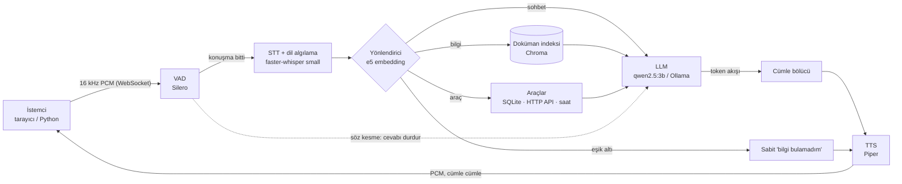

# AKINROBOTICS Sesli Yapay Zeka Ajanı

Kullanıcıyı dinleyen, soruyu bilgi kaynaklarından (doküman, veritabanı, API) cevaplayan ve cevabı sesli söyleyen, uçtan uca (sesten sese) çalışan bir ajan. Türkçe ve İngilizce konuşur; hangi dilde sorulursa o dilde cevap verir. Bütün bileşenler açık kaynaktır ve yerelde çalışır; hiçbir bulut servisine bağımlı değildir.

```
mikrofon → VAD → STT → yönlendirme → (RAG | araç | sohbet) → LLM → cümle cümle TTS → hoparlör
```

## Hızlı başlangıç (Docker)

```bash
docker compose up --build                                                      # CPU, her makinede çalışır
docker compose -f docker-compose.yml -f docker-compose.gpu.yml up --build      # NVIDIA GPU ile
```

Tarayıcıda **http://localhost:8000** adresini açın, **Başlat**'a basın, mikrofona izin verin ve konuşun.

- İlk çalıştırmada imaj derlenir (Whisper, embedding ve Piper modelleri imaja gömülür) ve Ollama LLM'i indirir (~2 GB). Sonraki açılışlar internet gerektirmez.
- GPU dosyası için NVIDIA Container Toolkit gerekir (Windows'ta Docker Desktop + WSL2 ile hazır gelir).
- Mikrofon, tarayıcı kuralı gereği yalnızca `localhost` veya HTTPS üzerinden açılır. Sunucu başka makinedeyse Python istemcisini kullanın.
- CPU modunda sistem çalışır ama yavaştır (yalnızca STT ~4 sn); ölçümler GPU ile alınmıştır.

Denenecek sorular: "Ada-7 kaç kilogram?", "What is AROS?", "En hızlı robot hangisi?", "Hangi robot arızalı?", "Saat kaç?", "Ada-7 uçabilir mi?" (cevapsız), "Bugün hava nasıl?" (kapsam dışı).

## Docker'sız kurulum

Python 3.12 ve [Ollama](https://ollama.com) gerekir.

```bash
python -m venv .venv && .venv\Scripts\activate     # Linux/macOS: source .venv/bin/activate
pip install -r requirements.txt
ollama pull qwen2.5:3b
python -m scripts.download_models                  # Piper sesleri -> models/piper
python -m scripts.ingest                           # knowledge/ -> vektör indeksi + robot veritabanı
uvicorn app.main:app --port 8000
```

İstemci olarak tarayıcı (http://localhost:8000) veya `pip install -r client/requirements.txt && python client/voice_client.py` kullanılabilir. GPU yoksa `config.yaml` içinde `stt.device: cpu` yapın.

## Mimari



Sunucu tek bir FastAPI sürecidir; istemci yalnızca "kulak ve ağız"dır (bir robottaki sensör düğümü gibi), bütün modeller sunucuda çalışır. Kaskad (STT → LLM → TTS) mimari bilinçli bir seçimdir: tek parça sesten-sese modellerin aksine her aşamanın metni görülebilir, cevabın kaynağı denetlenebilir ve her bileşen tek tek değiştirilebilir. Bunun bedeli olan gecikme, akış (streaming) ile azaltılır: LLM yazarken tamamlanan her cümle hemen seslendirilip gönderilir.

### Bileşen seçimleri ve gerekçeleri

| Bileşen | Seçim | Neden |
|---|---|---|
| VAD | Silero VAD (ONNX, CPU) | 32 ms'lik parçaları ~1 ms'de puanlar. STT'ye yalnızca konuşma gider; gürültüde Whisper 10+ sn takılıyordu. |
| STT | faster-whisper `small`, GPU, int8 | Dili aynı geçişte algılar (ayrı model yok). `base` hızlı ama ürün adlarını yanlış duyuyor; `small`/CPU 3,9 sn, GPU/int8 0,9 sn; float16 GTX 1650'de 3 kat yavaş. |
| Dil seçimi | Varsayılan Türkçe; İngilizceye yalnızca P(en) ≥ 0,3 ve P(en) > 2·P(tr) ise geçilir | Kısa Türkçe kelimeler düşük güvenle başka dil sanılıyordu. Üç kural 18 kayıtta karşılaştırıldı: 16/18, 15/18, seçilen 18/18. |
| Embedding | `multilingual-e5-small` (CPU) | Tek modelle Türkçe ve İngilizce; İngilizce soru Türkçe dokümanda doğru bölümü buluyor (0,852). Aynı model yönlendirmede de kullanılır. |
| Vektör deposu | Chroma (gömülü) | Ayrı servis gerektirmez; bu ölçekte arama ~30 ms. |
| LLM | `qwen2.5:3b`, Ollama | 4 GB VRAM'e Whisper ile birlikte sığan, Türkçesi kullanılabilir en büyük model. `temperature: 0`: aynı soruya aynı cevap. |
| TTS | Piper (VITS/ONNX, CPU) | RTF ≈ 0,06; GPU'yu LLM ve STT'ye bırakır. Dil başına bir ses. |
| Araç seçimi | Anlamsal yönlendirme + anahtar kelime (LLM function-calling yok) | 3B model function-calling'de güvenilir değil ve fazladan LLM çağrısı 1–2 sn ekler. Yönlendirme ek model gerektirmez, ~0 ms. |
| Veritabanı aracı | Sabit sorgu + sütun beyaz listesi (text-to-SQL yok) | Konuşmadan gelen metni SQL'e koymak güvenlik riski; sayı filtresi SQL'de yapılır çünkü LLM "8 saat"i "8'den fazla" saydı. |

Bu kararların arkasındaki ölçümler ve denenip vazgeçilen seçenekler `NOTLAR.md` dosyasındadır.

### Case beklentileri

| Beklenti | Nasıl karşılandı |
|---|---|
| Çok dillilik | Whisper dili algılar; LLM talimatı, hazır cevaplar ve TTS sesi o dile göre seçilir. Dokümanlar Türkçe, arama diller arası. |
| Doğruluk | Cevaplar yalnızca üç kaynaktan gelir: dokümanlar (RAG), SQLite veritabanı (karşılaştırma soruları), HTTP API (canlı robot durumu). Aşağıdaki "Halüsinasyon kontrolü" bölümüne bakın. |
| Açık platform | Bütün modeller açık kaynak ve yerel. LLM için iki sağlayıcı vardır: Ollama ve OpenAI-uyumlu API (llama.cpp, vLLM, LM Studio…). |
| Düşük gecikme | Cümle cümle akış, model ısıtma, kısa bağlam (top_k=2, konuşma geçmişi yerine konu takibi), LLM'siz hazır cevaplar, ortak sistem promptu (önbellek). Ölçümler aşağıda. |
| Özelleştirilebilirlik | Bütün seçimler `config.yaml` içinde. Yeni model = bir alt sınıf + `factory.py`'de bir satır; yeni araç = bir `Tool` alt sınıfı; yeni doküman = `knowledge/` klasörüne dosya. |
| Sürdürülebilirlik | Katmanlı ve küçük modüller, arayüzler (`providers/base.py`, `tools/base.py`), her tur için yapılandırılmış log (`logs/turns.jsonl`), model gerektirmeyen testler, Docker. |

## Halüsinasyon kontrolü

Tek bir önlem yetmediği için katmanlıdır; her katman ölçülerek eklenmiştir.

1. **Erişim eşiği.** En iyi doküman parçasının benzerliği 0,80'in altındaysa LLM hiç çağrılmaz, sabit "bilgi bulamadım" cümlesi söylenir (ilgili sorular 0,84–0,90, ilgisizler 0,66–0,79 skor aldı). Hem en güvenli hem en hızlı yol.
2. **Yalnızca bağlam.** Sistem promptu dış bilgiyi yasaklar; araç çıktıları da aynı "yalnızca bağlam" promptuyla LLM'e verilir.
3. **Hazır red cümlesi.** Konuyla ilgili ama cevabı dokümanda olmayan sorular ("Ada-7 uçabilir mi?", "ARAT'ın fiyatı?") eşiği geçer. Promptun son satırındaki "bağlam açıkça cevaplamıyorsa şunu söyle: …" kuralı bu sette doğruluğu 2/7'den 6/7'ye çıkardı (son sette 7/8).
4. **Sohbet ayrı yolda.** "Merhaba", "Sen kimsin?" bağlamsız ve "teknik bilgi söyleme" kuralıyla cevaplanır; sohbet olguya dönüşemez.
5. **Hesap LLM'e bırakılmaz.** Karşılaştırma ve sayı filtreleri SQL'de yapılır; saat ve robot durumu araçtan gelir.
6. **Araç cevaplayamıyorsa zorlanmaz.** Soru araca gidip araçta karşılığı yoksa ("En akıllı robot hangisi?") araç `ToolNotApplicable` fırlatır ve soru doküman yoluna düşer.
7. **Araç hatası uydurulmaz.** API kapalıysa araç `ToolUnavailable` fırlatır ve mesaj LLM'den geçmeden aynen söylenir (LLM "ulaşılamıyor"u "servis altında" diye çarpıtmıştı).
8. **Bölüm bazlı parçalama.** Her `##` bölümü bir parçadır; karışık parçalar yanlış robotun değerini getiriyordu.
9. **İzlenebilirlik.** Her turda yol (rag/araç/sohbet/cevap yok), kaynak dosya ve skor loglanır; tarayıcı istemcisi kaynağı gösterir.

## Ölçüm sonuçları

**Donanım:** dizüstü bilgisayar · Intel Core i7-10750H (6 çekirdek / 12 iş parçacığı) · NVIDIA GTX 1650 4 GB · RAM: **?? GB** · Windows · Python 3.12 · Ollama 0.40. Whisper ve LLM aynı 4 GB GPU'yu paylaşır; embedding, VAD ve TTS CPU'da çalışır.

### Gecikme

Sunucunun her tur için yazdığı `logs/turns.jsonl` kayıtlarından (`python -m scripts.benchmark`), gerçek mikrofonla 44 tur. Süreler ms ve medyandır; t=0 VAD'in "kullanıcı sustu" dediği andır. **Yanıt gecikmesi** = VAD'in beklediği 500 ms sessizlik + ilk cevap sesinin hazır olması, yani kullanıcının sustuğu andan cevabın başlamasına kadar geçen süredir.

| Yol | Tur | STT | LLM ilk token | İlk ses | Yanıt gecikmesi p50 | p95 | Toplam |
|---|---:|---:|---:|---:|---:|---:|---:|
| Bilgi (RAG) | 14 | 1142 | 4156 | 4598 | 5098 | 7390 | 4703 |
| Araç | 6 | 1162 | 1830 | 2191 | 2691 | 9074 | 2197 |
| Sohbet | 6 | 1151 | 1345 | 1707 | 2207 | 2671 | 1968 |
| Cevap yok (LLM'siz) | 18 | 1171 | 1195 | 1337 | 1837 | 2264 | 1345 |
| Tümü | 44 | 1155 | 1482 | 1740 | 2240 | 7390 | 1839 |

Bu kayıtlar geliştirme sırasında, ayarlar değişirken toplanmıştır; yol başına tur sayısı azdır. Araç yolundaki 9 sn'lik p95, sonradan düzeltilen tek bir turdur (araçta karşılığı olmayan soru bütün tabloyu bağlama koyuyordu).

Sürenin nereye gittiği (bilgi sorusu): VAD beklemesi 500 ms · STT ~1150 ms · arama + yönlendirme ~30 ms · LLM'in bağlamı okuması ~2500–3000 ms · ilk cümlenin yazılması ~300 ms · TTS ~150 ms.

- **Darboğaz LLM'in bağlamı okumasıdır.** GTX 1650'de prompt işleme ~200 token/sn'dir ve süre bağlamdaki token sayısıyla doğrusaldır (~5 ms/token). Bağlam gerektirmeyen yollar 2 sn civarında cevap verir.
- **STT süresi konuşma uzunluğundan bağımsızdır** (~1,1 sn): Whisper her sesi 30 sn'ye tamamlayarak işler.
- Cümle cümle akış sayesinde "ilk ses" ile "toplam" arasındaki fark kullanıcıya bekleme olarak yansımaz; cevabın devamı, ilk cümle çalarken üretilir.

Gecikme için yapılanlar ve ölçülen etkileri:

| Değişiklik | Etki |
|---|---|
| Ollama adresi `localhost` → `127.0.0.1` (Windows IPv6 beklemesi) | ilk token 2,6 sn → 0,3 sn |
| Whisper CPU → GPU int8 | 3,9 sn → 0,9 sn |
| top_k 3 → 2, geçmiş 3 → 1 tur | ilk cümle 3268 → 2515 ms (doğruluk ±1 soru) |
| Konuşma geçmişi yerine konu takibi (takip soruları için son anılan isim soruya eklenir) | ilk cümle 2978 → 1683 ms, doğruluk 46 → 49/53, takip soruları 3/4 → 4/4 |
| Tek ortak sistem promptu (Ollama önbelleği), dil talimatı sonda | prompt işleme 2246 → 1891 ms |
| 100 karakteri geçen cümleyi virgülden bölme | 250 karakterlik tek cümle ilk sesi 7 sn'ye çıkarıyordu |
| Eşik altı ve araç hatalarında LLM'siz cevap | ~1,3 sn'de ilk ses |
| Açılışta LLM, STT ve TTS'i ısıtma | ilk turda model yükleme beklemesi yok |

### RTF (işlem süresi / ses süresi)

| Bileşen | RTF | Not |
|---|---:|---|
| STT (Whisper small, GPU int8) | 0,59 ortalama (en kötü 1,20) | Ortalama 2,3 sn'lik sorularda. Süre sabit olduğu için uzun konuşmada RTF düşer (6,4 sn'lik soruda 0,22). |
| TTS (Piper, CPU) | 0,060 ortalama | 3 sn'lik sesi ~180 ms'de üretir. |

### Doğruluk

| Test | Sonuç |
|---|---|
| Ajan, 42 soru (`scripts/eval_agent.py`) | **39/42**: bilgi 14/16 · sohbet 4/4 · kapsam dışı 3/3 · cevapsız 7/8 · araç 11/11 |
| STT, kendi sesimle 21 kayıt (`scripts/eval_stt.py`) | WER 0,30 · tam doğru 11/21 · dil seçimi 18/18 (ilk 18 kayıt) |

STT hataları cevabı çoğu zaman bozmaz: "Ada-7" "other 7" diye duyulduğunda bile anlamsal arama doğru bölümü buldu.

## Konuşma deneyimi

- **Söz kesme (barge-in):** Sunucu cevap verirken de dinler. Kullanıcı araya girerse (250 ms sesli konuşma) cevap durur, LLM üretimi iptal edilir ve yeni soru dinlenir. Cevap sırasındaki daha kısa sesler (yankı, tıkırtı) yok sayılır. Tarayıcının yankı engelleyicisi gerekir; Python istemcisi yankı engelleyemediği için konuşurken mikrofonu kapatır (yarı çift yönlü). `vad.barge_in: false` ile kapatılabilir.
- 100 ms'den az ses içeren parçalar (öksürük, tık) STT'ye gönderilmez; Whisper bunlara kelime uyduruyordu.
- Konuşma hızı `tts.length_scale` ile ayarlanır; liste ve markdown işaretleri seslendirilmeden temizlenir.

## Özelleştirme

- **Model değiştirmek:** `config.yaml`. Örneğin başka bir LLM sunucusu için `llm.provider: openai_compat`, `base_url`, `model`.
- **Yeni sağlayıcı (STT/LLM/TTS):** `app/providers/base.py` içindeki arayüzü uygulayan bir sınıf + `app/factory.py`'de bir satır.
- **Yeni araç:** `app/tools/base.py` içindeki `Tool`'dan türeyen sınıf (`examples`, isteğe bağlı `keywords`, `run()`), `factory.py`'deki kayıt sözlüğüne bir satır, `config.yaml`'da `tools.enabled`. Ajan koduna dokunulmaz; veritabanı aracı böyle eklendi.
- **Yeni bilgi kaynağı:** `knowledge/` klasörüne `.md`/`.txt` dosyası, sonra `python -m scripts.ingest` (Docker'da kapsayıcıyı yeniden başlatmak yeterli). Kaynakta özel isimler varsa (ör. "AKINSOFT") `stt.hotwords` cümlesine eklenir, yoksa Whisper bunları tanımayabilir. Ardından `tests/agent_questions.csv`'ye 2-3 soru eklenip `python -m scripts.eval_agent` ile eski soruların bozulmadığı kontrol edilir (regresyon testi).

## Testler ve ölçüm betikleri

```bash
pip install -r requirements-dev.txt
pytest                               # model/GPU gerektirmez: cümle bölücü, araçlar, sunucu ve söz kesme mantığı
python -m scripts.eval_agent         # 42 soruluk doğruluk + gecikme (Ollama gerekir)
python -m scripts.eval_stt           # kayıtlı seslerle WER, dil, RTF
python -m scripts.benchmark          # logs/turns.jsonl özeti + donanım bilgisi
python -m scripts.chat_text          # ajanla yazarak konuşma
```

## Proje yapısı

```
app/
  main.py            FastAPI + WebSocket sunucusu, tur yönetimi, söz kesme
  pipeline.py        bir tur: STT → ajan → cümle bölücü → TTS, süre ölçümü
  agent/             ajan, yönlendirici, doküman arama, promptlar
  tools/             saat, robot durumu (HTTP API), robot özellikleri (SQLite)
  providers/         VAD, STT, LLM, TTS arayüzleri ve uygulamaları
  static/index.html  tarayıcı istemcisi (cevapta adı geçen robotun görselini gösterir)
  static/robots/     robot görselleri — kaynak: akinrobotics.com (yalnızca bu demo için)
client/              Python istemcisi (mikrofon + hoparlör)
knowledge/           bilgi kaynakları (Markdown + CSV)
scripts/             indeksleme, model indirme, değerlendirme, benchmark
tests/               birim testleri ve değerlendirme setleri
config.yaml          bütün bileşen ve eşik ayarları
```

## Bilinen sınırlamalar

- Bilgi sorularında yanıt gecikmesi bu donanımda ~5 sn'dir; neredeyse tamamı LLM'in bağlamı okuma süresidir ve GPU ile ölçeklenir. Daha kısa parçalar (`rag.chunk_max_chars`) bir sonraki denenecek adımdır.
- Whisper `small` çok kısa cümlelerde hata yapar ("Saat kaç?" tanınmıyor); daha büyük model 4 GB VRAM'e LLM ile birlikte sığmıyor.
- 3B model bir cümlede birden çok sayı olduğunda karıştırabiliyor ve bazen aşırı temkinli davranıp cevabı olan soruya "bilgi bulamadım" diyor.
- Robot durum API'si örnek bir servistir (`/mock/robots`); gerçek kullanımda filo yönetim sisteminin adresi verilir.
- GPU'da aynı anda tek tur işlenir; birden çok istemci sıraya girer (her istemcinin konuşma konusu ayrıdır).
- Söz kesme, hoparlör sesi çok yüksekse yankı yüzünden yanlış tetiklenebilir; kulaklıkla sorun olmaz.

Bilgi tabanı (`knowledge/`) ve robot görselleri (`app/static/robots/`) akinrobotics.com'dan derlenmiştir
(Ekim 2026); telif hakları AKINROBOTICS'e aittir ve yalnızca bu değerlendirme projesinde kullanılmıştır.
